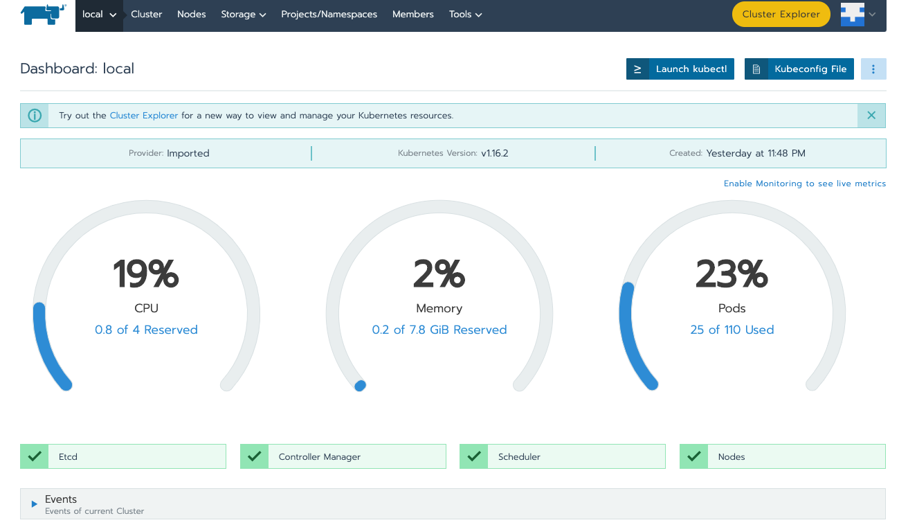
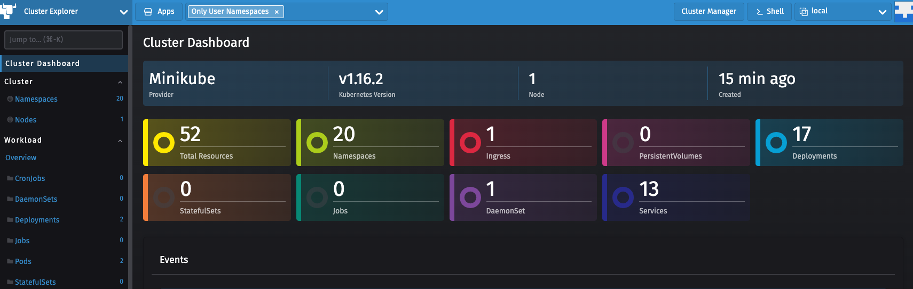
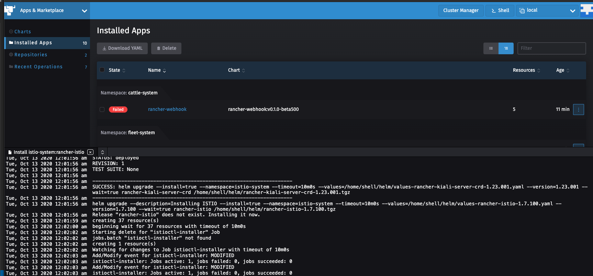
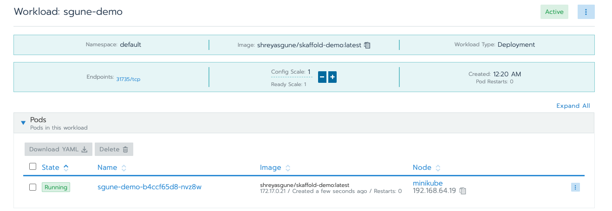
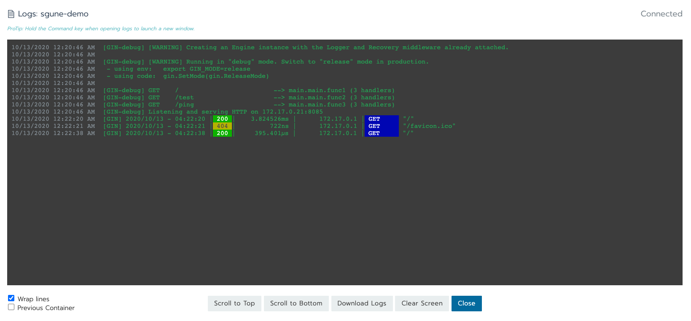
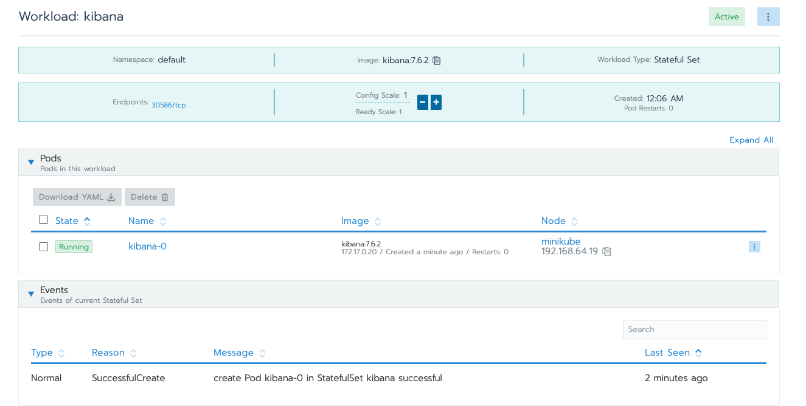

# rancher-demo
Running Rancher in minikube


## Setup Minikube /w Helm Addon
If you don't have minikube already installed, [click here](https://kubernetes.io/docs/tasks/tools/install-minikube/)

If you already do, proceed.
```
minikube config set memory 8192
minikube config set cpus 4
minikube start
minikube addons enable helm-tiller
```
> If you want to see a dashboard, you can open up a new terminal, set your kubeconfig to point to `[minikube:default]` and execute `minikube dashboard`

## Install cert-manager.io 

```
kubectl create namespace cert-manager

helm repo add jetstack https://charts.jetstack.io

helm repo update

helm install \
  --name cert-manager \
  --namespace cert-manager \
  --version v1.0.2 \
  jetstack/cert-manager \
  --set installCRDs=true
```

```
RESOURCES:
==> v1/ClusterRole
NAME                                    AGE
cert-manager-cainjector                 3s
cert-manager-controller-certificates    3s
cert-manager-controller-challenges      3s
cert-manager-controller-clusterissuers  2s
cert-manager-controller-ingress-shim    3s
cert-manager-controller-issuers         3s
cert-manager-controller-orders          3s
cert-manager-edit                       3s
cert-manager-view                       2s

==> v1/ClusterRoleBinding
NAME                                    AGE
cert-manager-cainjector                 2s
cert-manager-controller-certificates    2s
cert-manager-controller-challenges      2s
cert-manager-controller-clusterissuers  2s
cert-manager-controller-ingress-shim    2s
cert-manager-controller-issuers         2s
cert-manager-controller-orders          2s

==> v1/CustomResourceDefinition
NAME                                 AGE
certificaterequests.cert-manager.io  3s
certificates.cert-manager.io         3s
challenges.acme.cert-manager.io      3s
clusterissuers.cert-manager.io       4s
issuers.cert-manager.io              4s
orders.acme.cert-manager.io          4s

==> v1/Deployment
NAME                     READY  UP-TO-DATE  AVAILABLE  AGE
cert-manager             0/1    1           0          2s
cert-manager-cainjector  0/1    1           0          2s
cert-manager-webhook     0/1    1           0          2s

==> v1/MutatingWebhookConfiguration
NAME                  AGE
cert-manager-webhook  2s

==> v1/Pod(related)
NAME                                     READY  STATUS             RESTARTS  AGE
cert-manager-cainjector-7fcc8f5bf-tw7v6  0/1    ContainerCreating  0         2s
cert-manager-f9cc45844-lqnkp             0/1    ContainerCreating  0         2s
cert-manager-webhook-54c48956db-wfnj2    0/1    ContainerCreating  0         2s

==> v1/Role
NAME                                    AGE
cert-manager-cainjector:leaderelection  2s
cert-manager-webhook:dynamic-serving    2s
cert-manager:leaderelection             2s

==> v1/RoleBinding
NAME                                    AGE
cert-manager-cainjector:leaderelection  2s
cert-manager-webhook:dynamic-serving    2s
cert-manager:leaderelection             2s

==> v1/Service
NAME                  TYPE       CLUSTER-IP     EXTERNAL-IP  PORT(S)   AGE
cert-manager          ClusterIP  10.101.79.250  <none>       9402/TCP  2s
cert-manager-webhook  ClusterIP  10.110.110.58  <none>       443/TCP   2s

==> v1/ServiceAccount
NAME                     SECRETS  AGE
cert-manager             1        4s
cert-manager-cainjector  1        4s
cert-manager-webhook     1        4s

==> v1/ValidatingWebhookConfiguration
NAME                  AGE
cert-manager-webhook  2s


NOTES:
cert-manager has been deployed successfully!
```

> Verify using `kubectl get pods --namespace cert-manager`

## Install Rancher
```
helm repo add rancher-latest https://releases.rancher.com/server-charts/latest

helm repo update

kubectl create namespace cattle-system

helm install --name rancher --namespace cattle-system rancher-latest/rancher --set hostname=local.dev
```

```
RESOURCES:
==> v1/ClusterRoleBinding
NAME     AGE
rancher  4s

==> v1/Deployment
NAME     READY  UP-TO-DATE  AVAILABLE  AGE
rancher  0/3    3           0          4s

==> v1/Pod(related)
NAME                      READY  STATUS             RESTARTS  AGE
rancher-869cf5588b-44g56  0/1    ContainerCreating  0         4s
rancher-869cf5588b-dpdlj  0/1    ContainerCreating  0         4s
rancher-869cf5588b-lqm2f  0/1    Terminating        0         3m13s
rancher-869cf5588b-npnbw  0/1    ContainerCreating  0         4s

==> v1/Service
NAME     TYPE       CLUSTER-IP     EXTERNAL-IP  PORT(S)  AGE
rancher  ClusterIP  10.108.63.162  <none>       80/TCP   4s

==> v1/ServiceAccount
NAME     SECRETS  AGE
rancher  1        4s

==> v1beta1/Ingress
NAME     HOSTS           ADDRESS  PORTS  AGE
rancher  local.dev       80, 443  4s

==> v1beta1/Issuer
NAME     AGE
rancher  3s
```

> Verify with `kubectl -n cattle-system rollout status deploy/rancher`
```
Waiting for deployment "rancher" rollout to finish: 2 of 3 updated replicas are available...
deployment "rancher" successfully rolled out
```

Note: Get the Ingress IP by `kubectl get ingresses -n cattle-system` and add that IP to your `/etc/hosts` file with value `local.dev` 

> Verify with `https://local.dev`

## Explore Rancher
`https://local.dev/dashboard/c/local/explorer` give you insight into your minikube cluster.





You could also try installing community apps


## Workloads

### Install Workload : shreyasgune/skaffold-demo
Deploying my demo server
```
    Name: sgune-demo
    Docker Image: shreyasgune/skaffold-demo:latest
    Port Mapping: nodeport 8085
```

- Verify 
```
curl http://local.dev:31735/                                                                                           "message":"Hello from 172.17.0.21, it's 10-13-2020 04:20:46 Tuesday right now."}
```



### Install Workload : Kibana
```
    Name: kibana
    Docker Image: kibana:7.6.2
    Port Mapping: nodeport 5601
    Environment Variables: ELASTICSEARCH_HOSTS = http://es:9200
```

```
NAME           READY   STATUS    RESTARTS   AGE
pod/kibana-0   1/1     Running   0          2m28s

NAME                      TYPE        CLUSTER-IP       EXTERNAL-IP   PORT(S)          AGE
service/kibana            ClusterIP   10.98.248.118    <none>        5601/TCP         2m28s
service/kibana-nodeport   NodePort    10.111.161.107   <none>        5601:30586/TCP   2m28s
service/kubernetes        ClusterIP   10.96.0.1        <none>        443/TCP          26m

NAME                      READY   AGE
statefulset.apps/kibana   1/1     2m28s
```

>verify Kibana using NodePort : `local.dev:30586`


# Cleanup
`minikube delete`